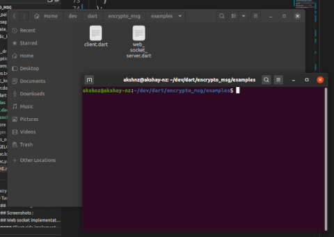
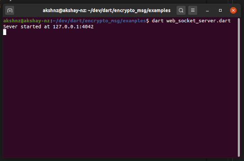
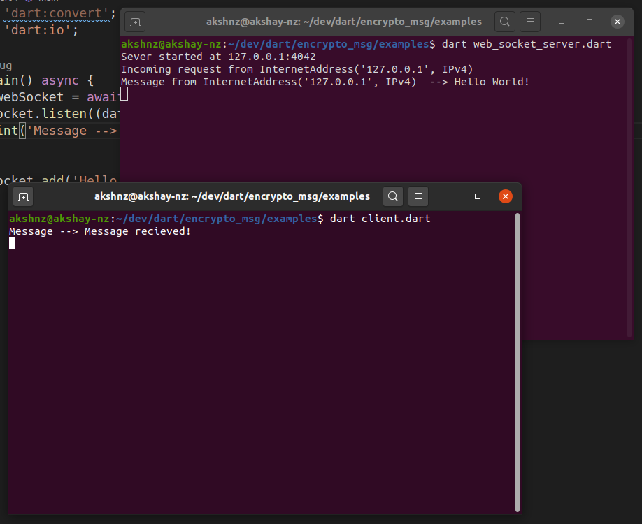

# encrypto_msg
- Encrypted web socket terminal messaging implemented using dart-lang.
- RSA encryption and AES encryption algorithms are used for encryption.

## Task list :
- [X] Implemented simple web socket.
- [X] Large prime generator implemented.
- [ ] RSA algorithm implementation.
- [ ] AES algorithm implementation.
- [ ] Encrypted terminal messaging.

### Screenshots : 
- work in progress

### Web socket implementation in dart-lang :
> WebSocket is a communications protocol for a persistent, bi-directional, full duplex TCP connection from a user’s web browser to a server.
#### Server side implementation :
1. Add shelf package in your project.
  * Add this to your package's **pubspec.yaml** file.
  ```yaml
  dependencies:
    shelf: ^0.7.9
  ```
  
 2. Create web server in **web_socket_server.dart** file.
 ```dart
  void main() async{
    var address = InternetAddress.loopbackIPv4;
    var port = 4042;
  
    var server = await HttpServer.bind(address, port);

    print('Sever started at ${server.address.address}:${server.port}');
  }
 ```
 
 3. Add request listener to it.
 ```dart
  server.listen(
    (HttpRequest request) async {
      print("Incoming request from ${request.connectionInfo.remoteAddress}");
    }
  );
 ```
 
 4. Upgrade http request to web socket.
 ```dart
  var webSocket = await WebSocketTransformer.upgrade(request);
 ```
 
 5. Add web socket request listener.
 ```dart
  webSocket.listen(
    (data) {
      print('Message from ${request?.connectionInfo?.remoteAddress}  --> ${data}');   

      webSocket.add('Message received');   
    }
  );
 ```
 
#### Client side implementation :
1. Create another file **client.dart**.
```dart
  void main() async{
    var webSocket = await WebSocket.connect('ws://127.0.0.1:4042');
  }
```

2. Add handler to it.
 ```dart
  webSocket.listen(
    (data) {
      print('Message --> ${data}');      
    }
  );
 ```
 
 3. Use **add** method to send message to server.
 ```dart
  webSocket.add('Hello World!');
 ```
 - _data must be in the form of **String** or **List\<int>**._

### How to bring it in action?
1. Open terminal where both files are located i.e. **web_scoket_server.dart** and **client.dart**.


* _For windows user open cmd or powershell in the same directory._

2. First run **web_socket_server.dart**.
  - Type the following command in terminal.
```bash
  dart web_socket_server.dart
```



3. Now run **client.dart**.
- Now open another terminal in the same directory.
- Type the following command in terminal.
```bash
  dart client.dart
```
- It will send **Hello World!** to the server.
- The server will send a response to the client when the message is received.



[To see code in action click here!](./examples/web_socket_server.dart)

[For more documented info](https://api.dart.dev/stable/2.9.1/dart-io/WebSocket-class.html)
